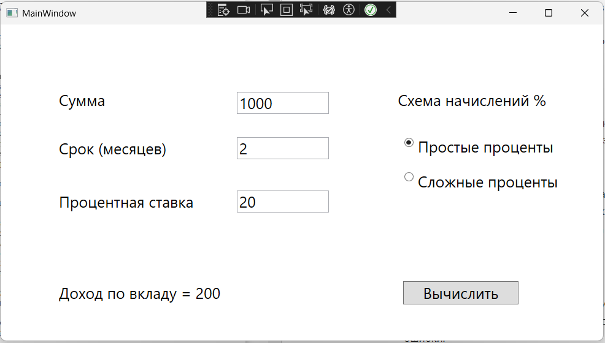
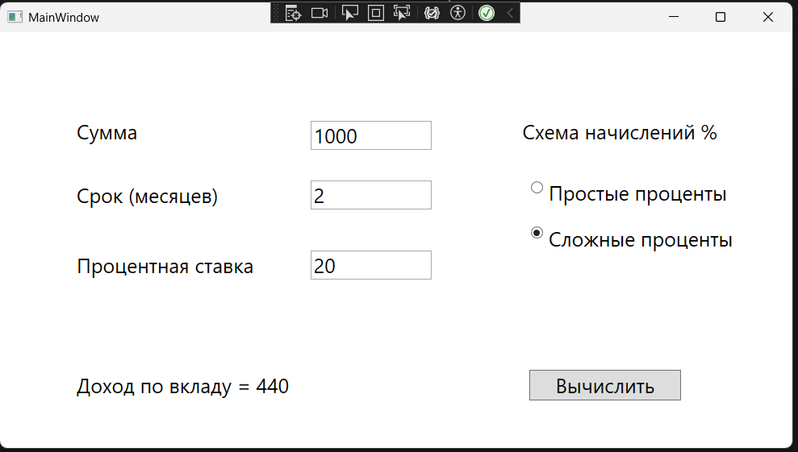

1. Я установил точки останова в следующих местах в методе CalculateButton_Click:
- После проверки входных значений для Sum, Term и Rate. Это позволит следить за тем, какие данные вводятся пользователем.
- В блоках для вычисления результата (как для простой, так и для сложной схемы). Это поможет увидеть, как считаются значения.
2. Запустил приложение в режиме отладки, нажав F5 в Visual Studio. Когда программа дойдет до первой точки останова проверим значения Sum, Term и Rate в "локальных переменных".
3. Проверяем верность данных
4. Проверяем расчет дохода: необходимо убедиться, что вычисление простой и сложной схемы работает исправно
Возьмем для примера данные:
Сумма 1000, Срок 2 месяца, Проц. ставка 20%.
Простая схема: 1000*0.2 = 200
Сложная схема: 
1) 1000*0.2+1000 = 1200
2) 1200*0.2+1000 = 1440
1440-1000=440
5. После выполнения расчетов обратим внимание на возвращаемое значение. В label выводится результат. Его сравниваем с фактическим, который мы вычислили самостоятельно

